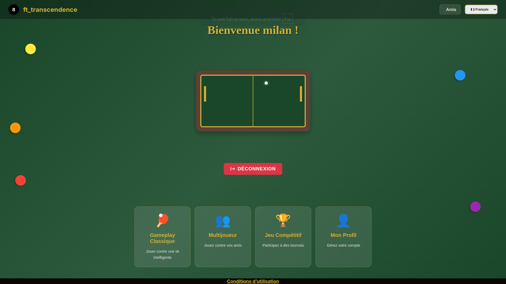
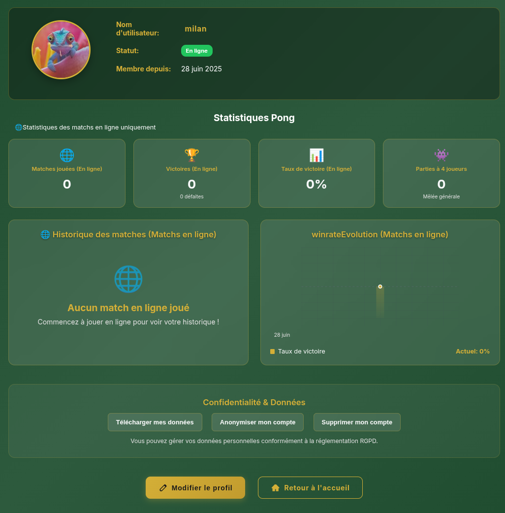
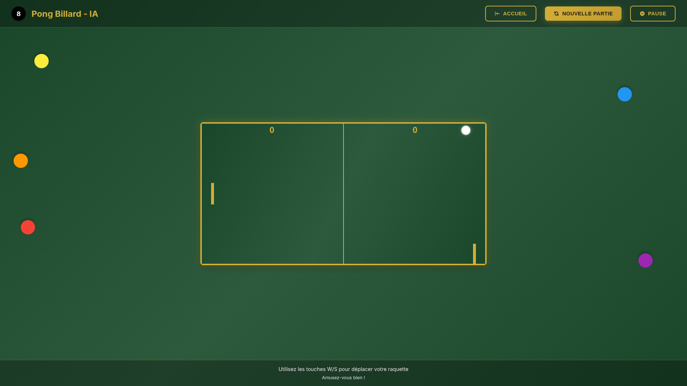
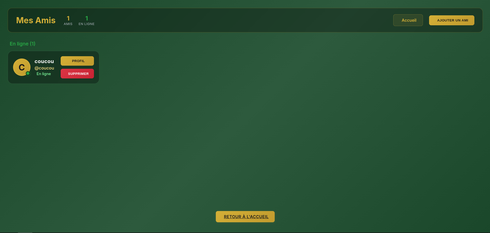

# ft_transcendence

A modern online Pong game with a web interface, developed as part of the 42 curriculum.

## 🎮 Aperçu du Projet

ft_transcendence is a complete web application that reimplements the classic game Pong with modern multiplayer features. The project includes an authentication system, user profiles, game statistics and real-time gameplay.

## 📸 ScreenShots

### Home page

*Interface principale avec menu de navigation et options de jeu*

### Profil page with stats

*Profil détaillé avec statistiques complètes et graphiques de progression*

### Gameplay

*Jeu Pong en cours avec interface de score et contrôles*

### Friend system

*Gestion des amis avec statuts en ligne et options d'interaction*

## ✨ Fonctionnalités

### 🏠 Interface Principale
- **Accueil personnalisé** : Interface d'accueil avec message de bienvenue
- **Menu principal** avec accès rapide aux différentes sections :
  - Gameplay Classique (jeu contre IA)
  - Mode Multijoueur (jeu contre d'autres joueurs)
  - Jeu Compétitif (tournois)
  - Profil utilisateur

### 👤 Système de Profil
- **Profils utilisateur complets** avec :
  - Avatar personnalisable
  - Nom d'utilisateur unique
  - Statut en ligne/hors ligne
  - Date d'inscription
- **Gestion des données** :
  - Téléchargement des données personnelles
  - Anonymisation du compte
  - Suppression du compte

### 📊 Statistiques Détaillées
- **Statistiques de jeu** :
  - Nombre de matches joués
  - Victoires et défaites
  - Taux de victoire
  - Parties à 4 joueurs
- **Historique des matches** avec graphiques
- **Évolution du taux de victoire** dans le temps

### 🎯 Gameplay
- **Jeu Pong classique** avec :
  - Contrôles fluides (touches W/S)
  - Affichage du score en temps réel
  - Interface de jeu épurée
  - Système de pause

### 👥 Social
- **Friends** :
  - Friend list with online status
  - Add/delete friends

### 🔓 Security
- **JSON Web Token**

## 🛠️ Technology

- **Frontend** : Vue avec TS
- **Multiplayer** : WebSockets
- **DataBase** : MariDB, SQL
- **Backend** : Fastify, Node.js, TS, Sequelize

## 🚀 Installation et Utilisation

### Prérequis
- .env (see .env.example)
- Docker & Docker Compose
- Web navigator

### Installation
```bash
# Clone the repository
git clone https://github.com/mkaliszc/ft_transcendence.git
cd ft_transcendence

# Launch the application with Makefile
make
